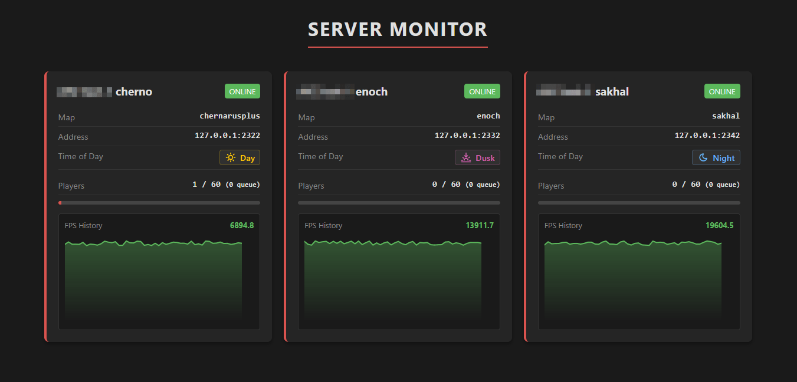

# Public Metrics Usage Example

This directory contains a minimal web example showing how to consume
public cached metrics from the MetricZ Exporter.

It demonstrates how an external client can read data from:

* `/api/v1/status`
* `/api/v1/status/{instance_id}`

and build a simple server status page without accessing
Prometheus or internal endpoints.

The exporter exposes a **restricted, read-only view**
of metrics controlled by `public_export`:
only explicitly allowed metrics and labels are returned,
values are aggregated, labels are sanitized, and sensitive data is removed.  
The output is safe for public access and aggressively cacheable.

The example frontend:

* polls the public API
* renders basic server cards and charts
* assumes labels are arrays (as returned by `public_export`)
* does not require authentication or external libraries

> [!NOTE]  
> A key advantage is flexibility: you can expose and visualize
> **any custom gameplay metrics** collected by the MetricZ mod.  
> This can include arbitrary in-game statistics
> (for example, world activity counters or player-driven events)
> and render them directly on your website via the public API,
> without additional infrastructure or noticeable overhead.

This is **not** a monitoring system and **not** a Prometheus replacement.
It is a reference implementation for public status pages
and third-party integrations.
